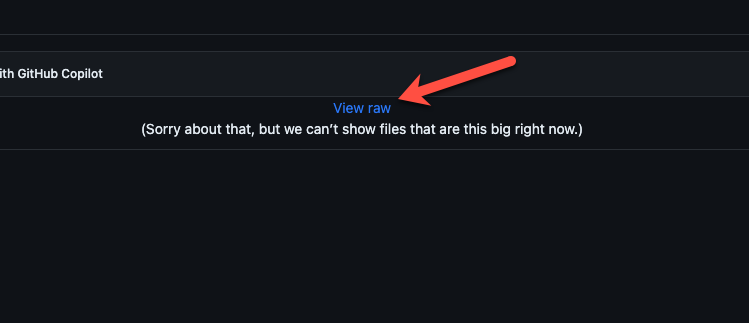

# README.md Generator

## Description
This allows the developer to create a readme.md file using node.js

### Watch the demo by clicking "View Raw":

https://github.com/viaheather/rm-gen-node/blob/main/assets/walkthrough.mp4

## Table of Contents
- [Installation](#installation)
- [Usage](#usage)
- [Credits](#credits)
- [License](#license)

## Installation
The user will clone this repository. The user will then enter “node index” into the terminal to be prompted questions regarding their project. 

## Usage
This saves the developer time from creating a readme from scratch. This project will take the inputs from the user to create a templated README.md for the user.

## Credits
This was cloned from an existing repo: https://github.com/coding-boot-camp/potential-enigma

## License
None

## Badges
None

## Features
Node.js

## GitHub Profile
https://github.com/viaheather

## How to Contribute
If the user wishes to contribute, the user will fork this repository and create a pull request. 

## Tests
Followed through prompts as if I am the end user and my README.md was generated.
